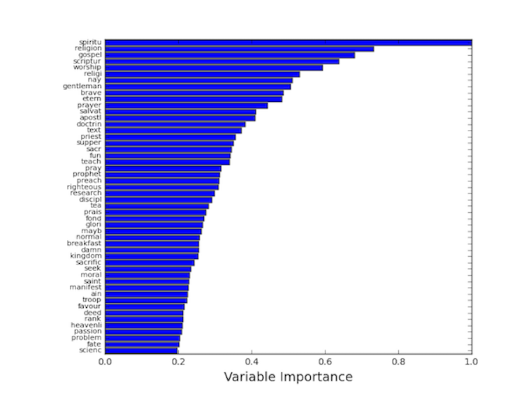

```{r, echo=FALSE, results = 'hide'}
library(randomForest)
library(MASS)
setwd('~/Github/Stat154FinalProject/')
```

Building our Random Forest models, we tried several different word feature matrices, leveraging a combination of metrics including absolute word count, tf-idf (term frequency - inverse document frequency), and relative word frequency within each document. For each feature set, a similar process was taken to determine which would yield the highest predictive power for determining the genre of unknown documents:   
  
1. Split the training observations into 5 or 10 stratified folds for cross validation (stratified by genre to maintain relative balance within each fold).  
2. Create a parameter grid to test in cross validation. {n-trees: 100, 250, 500, 1000, 2000; m-parameters: 20, 50, 100, 200; tree depth: 10, 25, 50}  
3. Store mean accuracy rates for each parameter combination.  
4. Evaluate the marginal benefit in cross validation accuracy of increasing model complexity  

The various word matrices ranged in accuracy from ~81% for selection on word count only to >86% when selecting on a combination of metrics.
The following details the use of the above methodology on the final word matrix that we decided on which used a combination of absolute count to cut both particularly rare and common words, word frequencies to normalize the values document to document, and specifically frequent words in History and Religion to try to improve lower accuracy in these categories (22308 observations x 2500 features). To select the number of trees to use, we plot the mean error rates for each number of trees and default values of no maximum depth and square root of the number of features used at each split.  

```{r, echo=FALSE, fig.cap = 'Mean classification error rate in stratified 5-fold cross validation of Random Forest with a maximum depth of 50 and $m = sqrt{p} = 50$ predictors at each split. Error rates were recorded at n = 100, 250, 500, 1000, and 2000 tree models. Dashed red lines indicate 1 standard deviation above and below the mean error estimates within the 5 folds with the same parameters.'}
rfcv = read.csv('rf_cv.csv', header = TRUE)
err = 1-rfcv$mean[rfcv$max_depth == 50 & rfcv$m == 50]
stdv = rfcv$std[rfcv$max_depth == 50 & rfcv$m == 50]
ntree = unique(rfcv$ntree)
plot(x = ntree, y = err, 
     xlim = c(0, 2200), ylim = c(.125,.155),
     xlab = 'Number of Trees', ylab = 'Error Rate', main = 'Five Fold Cross Validation 
     Error Rates Over Size of Random Forest')
lines(x = ntree, y = err, col = 'black', lty = 1)
lines(x = ntree, y = err + stdv, col = 'red', lty = 2)
lines(x = ntree, y = err - stdv, col = 'red', lty = 2)
```
  
The above plot shows that the lowest error rate is obtained when using 1000 trees; however, to reduce computation time and model size to be near the 50mb limit, we decided to use the 500 tree model which only had an increase in error of $0.14026 - 0.13843 = 0.00183$.
  
```{r, echo = FALSE, fig.cap = 'Plots of Error rate vs number of features used at each split (left) and maximum depth (right)'}
par(mfrow = c(1, 2))
m = rfcv$m[rfcv$ntree == 500&rfcv$max_depth==50]
err = 1 - rfcv$mean[rfcv$ntree == 500&rfcv$max_depth==50]
plot(err~m, xlab = 'm features', ylab = 'error rate', main = 'Five Fold Cross Validation 
     Error Rates Over m Features Used to Determine Each Split')

max_depth = rfcv$max_depth[rfcv$ntree == 500&rfcv$m==50]
err = 1 - rfcv$mean[rfcv$ntree == 500&rfcv$m==50]
plot(err~max_depth, xlab = 'maximum tree depth', ylab = 'error rate', main = 'Five Fold Cross Validation 
     Error Rates Over Maximum Tree Depth')
```
  
Additionally, plots of both the number of features used at each tree split and the depth of each tree were decided to be 50 features and 50 depth respectively as they produced the lowest error rate among models with 500 trees. This model over a 10 fold cross validation had an overall accuracy of 86.97% and individual category accuracies of Child: 0.88763, History: 0.79503, Religion: 0.84372, and Science: 0.91455 which is detailed in the following confusion matrix (rows are predicted values, columns are actual values).  

```{r, echo = FALSE}
conf = matrix(c(6359,500,27,278,7164,787,4255,116,194,5352,87,202,1992,80,2361,378,190,67,6796,7431,7611,5147,2202,7348,22308), byrow = TRUE, nrow = 5)
rownames(conf) = c(as.character(0:3), 'total')
colnames(conf) = c(as.character(0:3), 'total')
conf
```
  
  
  
```{r}
```
  

Additionally, we can observe the most important stemmed words in our random forest classification with regards to decreasing node impurity.

  
After adding several power features including punctuation frequencies and mean word lengths, the accuracy of the random forest improved to an overall accuracy of 87.5% and class accuracies: Child: 0.86921, History: 0.81315, Religion: 0.84837, and Science: 0.92989.
```{r, echo = FALSE}
conf = matrix(c(6227,609,20,308,7164,702,4352,117,181,5352,68,205,2003,85,2361,264,185,72,6910,7431,7261,5351,2212,7484,22308), byrow = TRUE, nrow = 5)
rownames(conf) = c(as.character(0:3), 'total')
colnames(conf) = c(as.character(0:3), 'total')
conf
```
Overall, the power features increased our prediction accuracy using a similar 22308 x 2500 feature matrix by a slightly over 0.6%. This difference is not that large; however, adding these features does seem to bring up our prediction accuracy on History by nearly 2% which makes the differences between categories slightly closer. A bigger improvement was seen in the final validation kaggle set where accuracy increased by about 6% from 82.2% to 88.4% for the word only and word+power feature matrices respectively. Despite the improvement, we used the SVM model for our final kaggle result as it scored >92%.  
**all scripting for random forest was done in python using scikit learn library for computational speed considerations. python ran >10 quicker than R for the same cross validation tasks.**

